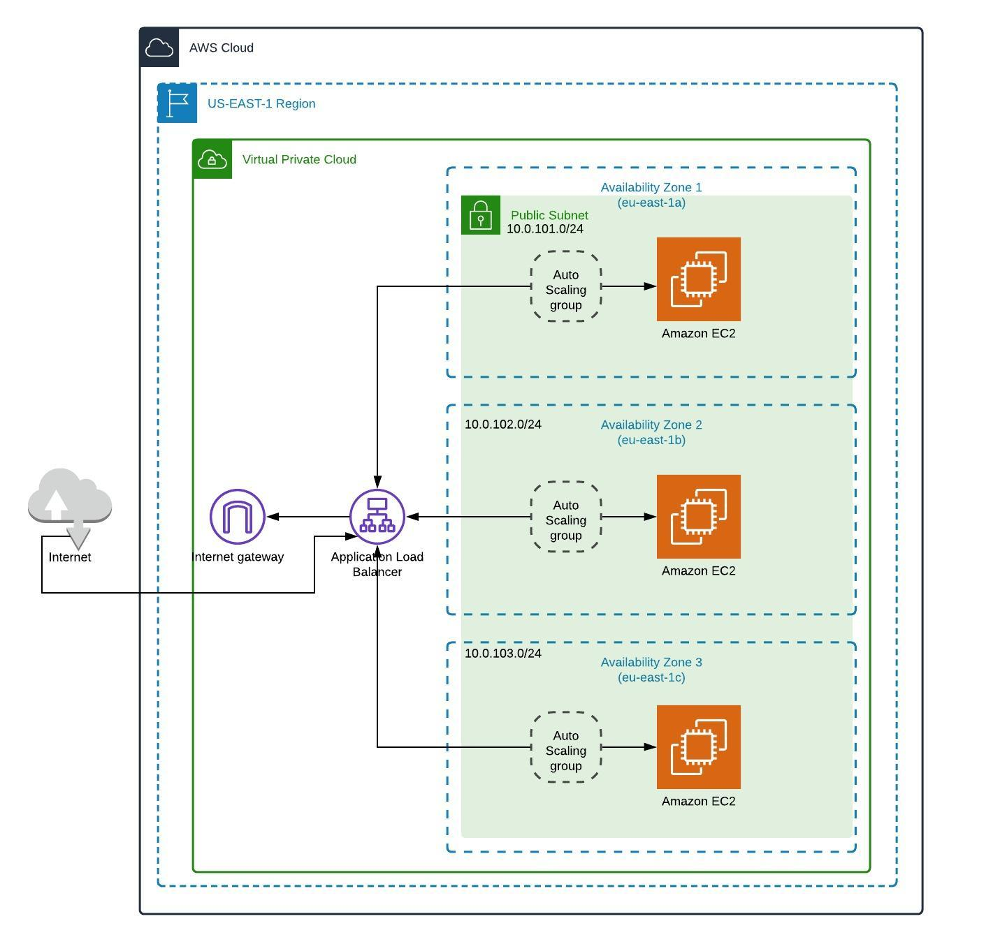

# Openverse Infrastructure Code Test

## Description

This repository is for deploying the frontend UI in AWS as well as the infrastructure required by the application within AWS.

## Technology

- Terraform
- AWS - Amazon Web Services
- The frontend app is built using Vue.js and Nuxt.js

## Architecture

The openverse frontend UI is deployed on a EC2 instance in a multi-az configuration across 3 public subnets. A internet gateway exposes the front end application to the internet.

A Application load balancer directs users to whichever EC2 instance with the least load. 

Auto scaling policies are implemented to scale the EC2 instances depending on the CPU or memory load on the application EC2 instance.



## Deployment to AWS

```bash
# install terraform cli
https://learn.hashicorp.com/tutorials/terraform/install-cli

# set AWS credentials 
https://docs.aws.amazon.com/cli/latest/userguide/cli-configure-envvars.html

$export AWS_ACCESS_KEY_ID=
$export AWS_SECRET_ACCESS_KEY=
$export AWS_SESSION_TOKEN=

# terrafrom init
$terraform init

# terraform plan
$terraform plan

#terraform apply
$terraform apply
```

## Formatting and Linting

The code in this repository is formatted using prettier. If you have prettier setup in your code editor it should work out of the box, otherwise you can use the npm run lintfix script to format and fix lint errors in your code. Checks are run to lint your code and validate the formatting on git precommit using husky.

## To Do
- [x] Update documentation
- [x] Create architecture diagram
- [x] Restructure repo
- [x] Seperate security groups and IAM resources
- [x] Update outputs.tf
- [x] Configure VPC creation and deployment
- [x] Configure Autoscaling
- [x] Configure Application Load Balancer

