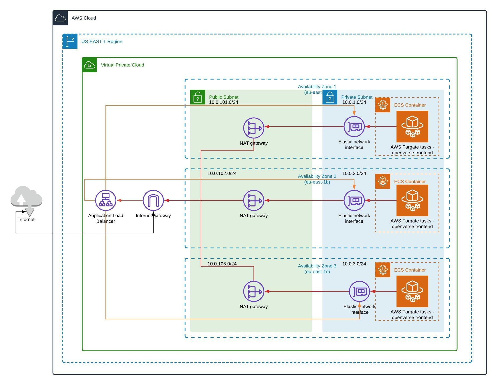

# Openverse Infrastructure Code Test

## Description

This repository is for deploying the frontend UI in AWS as well as the infrastructure required by the application within AWS.

## Technology

- Terraform
- AWS - Amazon Web Services
- Docker
- The frontend app is built using Vue.js and Nuxt.js

## Architecture

The architecture is based on a microservices architecture provided by AWS. It consists of running the openverse frontend UI in a containerized environment providing high availability and scalability making use of Docker, AWS ECS, AWS Fargate and AWS ECR.

The openverse frontend UI is deployed on a AWS ECS cluster within private subnets in a multi-az configuration. The frontend UI is then exposed via a AWS NAT Gateway and AWS Internet Gateway. 

The ECS Cluster auto scales depending on the CPU or memory load on the ECS containers. Users accessing the frontend UI are directed to the application container within the ECS Cluster with the least amount of load via an Application Load Balancer.



## Other Architecture concepts

Another improvement that can be made with the current application architecture is to separate the Redis database from the frontend application if possible. Autoscaling policies can then be added to the Redis database and deployed across multiple availability zones.

The frontend UI can then be deployed in public subnets in a multi-az configuration and the Redis database / backend within private subnets in a multi-az configuration.

AWS EKS can also be used instead of AWS ECS. This can allow for easier implementation on other cloud platforms. AWS ECS was selected purely for simplicity since the solution is running specifically on AWS.

## Deployment to AWS

Note, the deployment stage assumes that the container image has already been created and only needs to be uploaded to AWS ECR once the AWS ECR resource has been created by the Terraform deployment.

To create the docker container image view the application documentation.
https://github.com/WordPress/openverse-frontend/blob/main/README.md

```bash
# install terraform cli
https://learn.hashicorp.com/tutorials/terraform/install-cli

# set AWS credentials 
https://docs.aws.amazon.com/cli/latest/userguide/cli-configure-envvars.html

$export AWS_ACCESS_KEY_ID=
$export AWS_SECRET_ACCESS_KEY=
$export AWS_SESSION_TOKEN=

# terrafrom init
$terraform init

# terraform plan
$terraform plan

#terraform apply
$terraform apply
```

## Formatting and Linting

The code in this repository is formatted using prettier. If you have prettier setup in your code editor it should work out of the box, otherwise you can use the npm run lintfix script to format and fix lint errors in your code. Checks are run to lint your code and validate the formatting on git precommit using husky.

## To Do

- [x] Update documentation
- [x] Create architecture diagram
- [x] Update repo structure
- [x] Update variables.tf
- [x] Update outputs.tf
- [x] Configure ECS Cluster and Fargate tasks
- [x] Configure ECS Autoscaling
- [x] Configure ECS Load Balancer
- [x] Configure ECR resource
